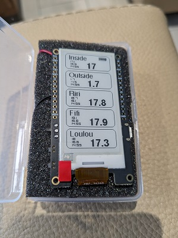

# Lilygo_T5_Epaper_Netatmo_Weather

Ce dépot contient le code permettant d'afficher les informations de sa station météo Netatmo sur une board ESP32 [Lilygo DEPG0213BN](https://www.lilygo.cc/products/t5-v2-3-1) à encre électronique.

Pour pouvoir utiliser les informations de votre station météo, vous devez créer un compte [ici](https://dev.netatmo.com/apps/). Ensuite vous devez paramétrer le fichier [TOCUSTOMIZE.h](./include/TOCUSTOMIZE.h) avec vos informations (Netatmo + Wifi). Dans ce fichier vous pouvez aussi paramétrer l'interval de réveil de la carte et votre écart local par rapport à l'heure UTC (Netatmo enregistre l'heure de mise à jour des capteurs en heure UTC)

Lors du premier lancement, il faut décommenter la ligne #define FORCE_NVS, builder, uploader sur votre board, la démarrer.
Puis lorsque l'affichage est ok, recommenter la ligne, builder, uploader sur votre board.

## Probable Bug

Mon équipement Netatmo est constitué de trois capteurs de température. Il est possible que cela plante s'il y a moins de capteurs.

## Roadmap

J'ai prévu d'adapter le code pour pouvoir l'utiliser sur un écran plus grand de [4.7 pouces](https://www.lilygo.cc/products/t5-4-7-inch-e-paper-v2-3)

## Licence

Ce projet est distribué sous la licence GNU General Public License v3.0. Pour plus de détails, veuillez consulter le fichier `LICENSE` dans ce dépôt.

## Contribution

Les contributions à ce projet sont les bienvenues. Si vous souhaitez contribuer, veuillez suivre les directives de contribution standards pour les projets GitHub.

## Support et Contact

Pour le support ou pour entrer en contact, veuillez ouvrir un ticket dans la section issues du dépôt GitHub.
